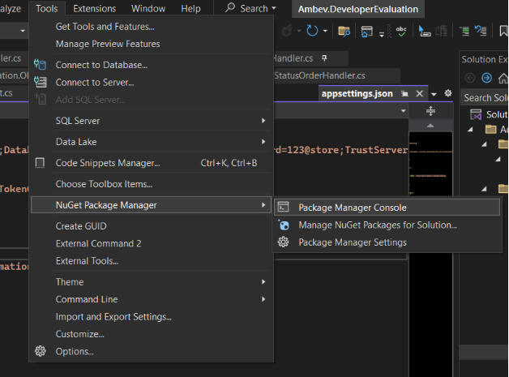
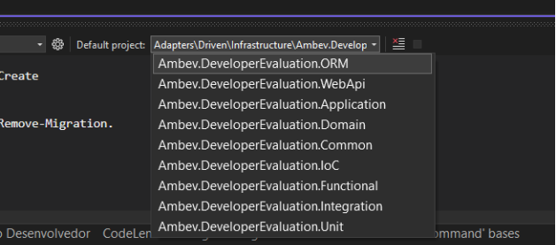
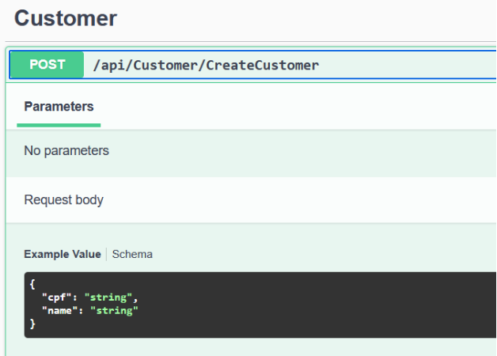
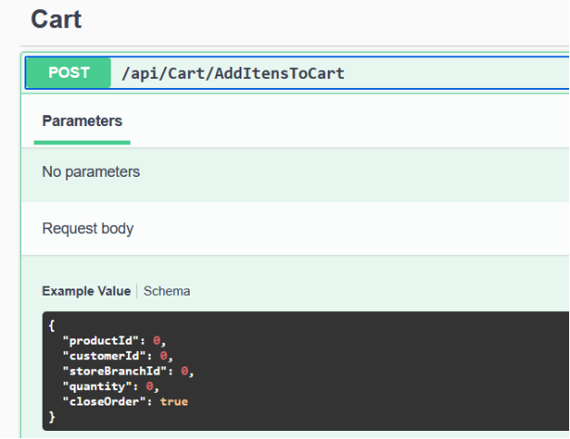
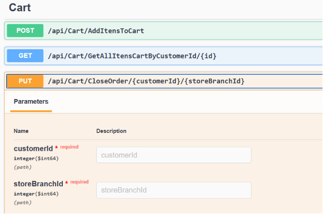

**Como rodar a aplicação!**

1- Entre na raiz do projeto e execute o arquivo docker-compose.yaml usando o comando 'docker-compose up --build'.

Com isso o banco de dados estará rodando.

2- Abra o projeto no visual studio, vá na opção 'Tools' -> 'Nuget Package Manager' -> 'Package Manager' como mostra o print abaixo:

**3-** Depois disso, va na janela que abriu la em baixo e selecione o projeto 'Ambev.DeveloperEvaluation.ORM' como mostra o print abaixo:

4 - Depois disse execute o seguinte comando para criar o banco de dados do projeto:  'Update-Database'

5 - Espere a execução terminar e rode o projeto no visual studio.

6- O projeto ja inicia com alguns produtos e duas filiais, disponiveis, caso vc queira cadastrar mais produtos e mais filiais, fique a vontade.

7- Você fazer um cadastro de um cliente para fazer os pedidos 

8 - Utilize o end point 'api/customer/createCustomer' para criar um cliente, como mostra o print abaixo:

8 - Agora vc pode adicionar itens no carrinho! Para isso use o end point do print abaixo: 

` `**Observação: Você pode fechar o pedido imediatamente ou você pode apenas adicionar no carrinho e depois chamar o seguinte endpoint para fechar seu pedido:** 

